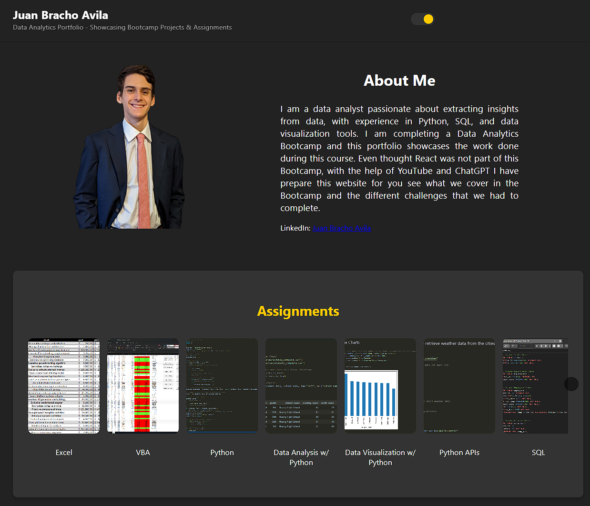

# Data Analytics Portfolio Website

This is a portfolio website designed to showcase assignments and projects completed during a data analytics bootcamp. The site features a hero section with a profile picture and "About Me" section, a carousel for assignments, and a carousel for projects. It also includes a theme toggle to switch between light and dark modes.



## Features

- **Hero Section**: Displays a profile picture and a short bio.
- **Assignments Carousel**: Scrollable carousel with a list of assignments.
- **Projects Carousel**: Scrollable carousel with a list of projects.
- **Theme Toggle**: Light and dark mode toggle in the top right corner.

## Technologies

- **React**: JavaScript library for building user interfaces.
- **CSS**: Custom CSS for styling components.
- **JavaScript**: Handles interactivity in the carousel and theme toggle.

## Setup Instructions

### Prerequisites

- Ensure you have **Node.js** and **npm** installed. You can download them from [Node.js](https://nodejs.org/).

### Installation

1. Clone the repository:
   ```bash
   git clone https://github.com/juanbracho/Data-Analytics-Porfolio
2. Navigate to the project directory:
   ```bash
    cd portfolio-website
3. Install the dependencies
    ```bash
    npm install
4. Run development server:
   ```bash
    npm start